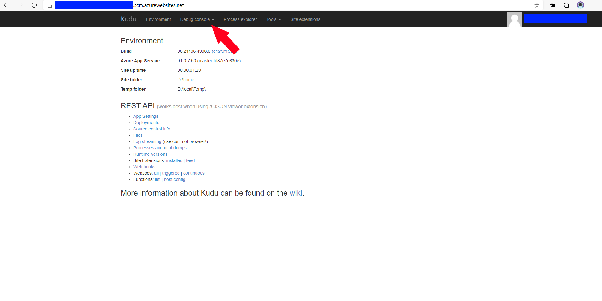
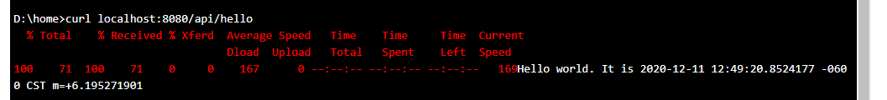

<div align="center">

# Debugging Trick for Service Hybrid Connections


Following along with this article will create **real** resource in Azure that cost **REAL** money. Make sure to destroy the resources once you do not need them.

</div>

---

**First and foremost**, read the following article about Hybrid Connections: [App Service Hybrid Connections][hcm].

## TLDR

The "trick" alluded to is to simply log into the Kudu console and execute a cURL command pointing to the HTTP Endpoint you want to hit. If it works, everything is set up. If it doesn't, then hopefully this provides some useful information as to why it is not working.

* cURL is a really helpful tool
* To navigate to the kudu backend, navigate to the URL created by appending `.scm.azurewebsites.net` to your App Service's name (`fooapp.scm.azurewebsites.net`).

## Intro

As this article is focused on a simple debugging trick for Azure App Service Hybrid Connections, the provisioning of resources will be *mostly* skipped over. If you want to follow along with the exact resources this article uses, please utilize the Deploy to Azure button provided below:


[](https://portal.azure.com/#create/Microsoft.Template/uri/https%3A%2F%2Fraw.githubusercontent.com%2FJoshuaTheMiller%2FExperiments%2Fmain%2Fazure%2FHybridConnections%2FHcExampleTemplate.json)

### Step 1 Kudu

To access Kudu, and the console, for your web app, navigate to the `scm` url. If you utilized all of the default options when configuring your App Service, this url should be your App Service name + `.scm.azurewebsites.net`. For example, if my App Service is named fooapp123, I can access Kudu by navigating to `fooapp123.scm.azurewebsites.net`

### Step 2 cURL



Now that you are logged into the backend of you App Service, navigate to the Debug console. Once there, execute the following command (inserting the address of the resource you want to hit):

```
curl localhost:8080/api/hello
```

### Step 3 Check

If all you have done is follow along with this so far, you should received a response saying *Bad Access*. At this point, you should check to see if Hybrid Connections have been configured properly.

If you used the ARM Template, you'll find that there are no Hybrid Connections added to this app! Go ahead and add it, and run the curl command again.

### Step 4 cURL again

Running cURL again will result in yet another error. Again, if you've been following along with this and have done nothing else, this is because HybridConnectionManager has not been setup locally! As such, go ahead and set up HCM (how do to this is detailed in the [App Service Hybrid Connections][hcm] mentioned above).

> ⚠
>
> ⚠ **NOTE**: there is some strange bug with HCM where, 
> 
> ⚠ for the Hybrid Connection to actually *connect*, you 
> 
> ⚠ may need to restart your machine.
> 
> ⚠

### Step 5 cURL again round 2

Yep, time to cURL again. If you did not receive a message stating `curl: (52) Empty reply from server`, please check Step 4 again. Did you restart your machine after adding the HybridConnection? If you did receive the previous message, great! It is because our local service is not running.

Provided under the 'apis' folder at the top of this repository is a file called `hello.go`. This can be ran with a simple command: `go run hello.go` (note: requires Go to be installed)..

Once running, it is time to move onto the next step...

### Step 6 cURL again round 3

cURL again! (it's a helpful tool) At this point, you should receive the "good" response:



## Summary

* cURL is a really helpful tool
* To navigate to the kudu backend, navigate to the URL created by appending `.scm.azurewebsites.net` to your App Service's name (`fooapp.scm.azurewebsites.net`).

## Helpful Reading

* [ARM Template Syntax](https://docs.microsoft.com/en-us/azure/azure-resource-manager/templates/template-syntax)
* [Creating the Azure Deploy button](https://docs.microsoft.com/en-us/azure/azure-resource-manager/templates/deploy-to-azure-button)


[hcm]: https://docs.microsoft.com/en-us/azure/app-service/app-service-hybrid-connections